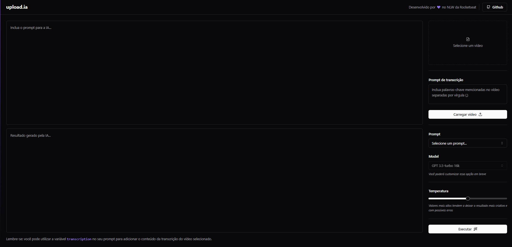

# Upload AI - web site

<p align="center">
  <a href="#-projeto">Project</a> &nbsp;&nbsp;&nbsp;|&nbsp;&nbsp;&nbsp;
  <a href="#-tecnologias">Technologies</a> &nbsp;&nbsp;&nbsp;|&nbsp;&nbsp;&nbsp;
  <a href="#how-to-use">How to use</a> &nbsp;&nbsp;&nbsp;|&nbsp;&nbsp;&nbsp;
  <a href="#common-mistakes">Common mistakes</a> &nbsp;&nbsp;&nbsp;|&nbsp;&nbsp;&nbsp;
  <a href="#project-vision">Project vision</a> &nbsp;&nbsp;&nbsp;|&nbsp;&nbsp;&nbsp;
</p>

## 💻 Project

The application developed in NLW AI is a title and description generator for YouTube videos. With the help of artificial intelligence, this tool provides creative and engaging suggestions to assist content creators in maximizing the reach and engagement of their videos.

When using the application, users will have access to a wide range of title and description options, customized according to the video's theme and relevant keywords. These suggestions are generated based on advanced algorithms that analyze YouTube data, search trends, and audience preferences.

## 🚀 Technologies

This project was developed with the following technologies:

- JavaScript
- TypeScript
- React
- Tailwind CSS
- Context API
- Fastify
- Prisma
- API OpenAI
- FFmpeg
- Webassembly

## How to use?

1. Download this repository and with your terminal, enter the directory

```
git clone SSH or HTTP
```

2. Select the folder you want to use first

```
cd folder
```

3. Run to install the dependencies

```
npm install OR yarn
```

4. And to start the application, run the command

```
npm dev OR yarn dev in front-end and back-end
```

## Common mistakes

1. Check if your node is on version 16.8 or node lts

# Project vision



<p align="center">Made by Pedro Henrique Lima</p>
